# Background Job System

## Bull Queue Architecture

**Purpose:** Handle scheduled notifications for bill due dates and recurring reminders using Bull queue with Redis.

**Key Queues:**

1. **`billNotifications`** - Send notifications before bill due dates
2. **`recurringBills`** - Create recurring bills based on schedule
3. **`overdueChecks`** - Check and update overdue tasks daily

**Queue Configuration:**

```typescript
// lib/queues/config.ts
import Queue from 'bull';

export const billNotificationsQueue = new Queue('billNotifications', {
  redis: {
    host: process.env.REDIS_HOST || 'localhost',
    port: parseInt(process.env.REDIS_PORT || '6379'),
    password: process.env.REDIS_PASSWORD || undefined,
  },
  defaultJobOptions: {
    attempts: 3,
    backoff: {
      type: 'exponential',
      delay: 2000,
    },
    removeOnComplete: 100, // Keep last 100 completed jobs
    removeOnFail: 200,     // Keep last 200 failed jobs
  },
});

export const recurringBillsQueue = new Queue('recurringBills', {
  redis: { /* same config */ },
});

export const overdueChecksQueue = new Queue('overdueChecks', {
  redis: { /* same config */ },
});
```

**Job Types:**

```typescript
// lib/queues/types.ts
export interface BillNotificationJob {
  taskId: string;
  userId: string;
  billId: string;
  dueDate: Date;
  notificationType: 'due_soon' | 'due_today' | 'overdue';
}

export interface RecurringBillJob {
  billId: string;
  recurrenceSettings: RecurrenceSettings;
}

export interface OverdueCheckJob {
  // No data needed, checks all tasks
}
```

**Cron Schedules:**

- **Bill Notifications:** Process every hour to check upcoming due dates
- **Recurring Bills:** Process daily at midnight to create new bills
- **Overdue Checks:** Process daily at 6 AM to mark overdue tasks

## Notification Workflow

```mermaid
sequenceDiagram
    participant Cron as Bull Cron Job
    participant Queue as Bull Queue
    participant Worker as Queue Worker
    participant DB as PostgreSQL
    participant LINE as LINE Messaging API
    participant User

    Note over Cron: Every hour
    Cron->>Queue: Add billNotifications job
    Queue->>Worker: Pick up job
    Worker->>DB: Query tasks WHERE dueDate BETWEEN now and +24hrs
    DB-->>Worker: Return upcoming tasks

    loop For each task
        Worker->>DB: Get user LINE ID
        Worker->>LINE: Send notification message
        LINE-->>User: 📌 Bill due in 24 hours: ฿1,500 MEA
        LINE-->>Worker: Delivery status
        Worker->>DB: Log notification sent
    end

    Worker->>Queue: Job complete
```



## Integration Points

**When Bill is Created:**
```typescript
// lib/services/BillService.ts
async createBill(data: CreateBillInput) {
  const bill = await prisma.bill.create({ data });
  const task = await prisma.task.create({
    data: { billId: bill.id, /* ... */ }
  });

  // Schedule notification jobs
  await scheduleNotifications(task);

  return { bill, task };
}

async function scheduleNotifications(task: Task) {
  const oneDayBefore = new Date(task.dueDate);
  oneDayBefore.setDate(oneDayBefore.getDate() - 1);

  const threeDaysBefore = new Date(task.dueDate);
  threeDaysBefore.setDate(threeDaysBefore.getDate() - 3);

  // Add jobs with specific delays
  await billNotificationsQueue.add(
    { taskId: task.id, notificationType: 'due_soon' },
    { delay: threeDaysBefore.getTime() - Date.now() }
  );

  await billNotificationsQueue.add(
    { taskId: task.id, notificationType: 'due_today' },
    { delay: oneDayBefore.getTime() - Date.now() }
  );
}
```

**Worker Implementation:**
```typescript
// lib/queues/workers/billNotifications.worker.ts
import { billNotificationsQueue } from '../config';
import { sendLINEMessage } from '../../integrations/line-messaging';

billNotificationsQueue.process(async (job) => {
  const { taskId, notificationType } = job.data;

  const task = await prisma.task.findUnique({
    where: { id: taskId },
    include: { bill: true, assignee: true },
  });

  if (!task || task.status === 'PAID') {
    return { skipped: true, reason: 'Task already paid' };
  }

  const message = buildNotificationMessage(task, notificationType);

  await sendLINEMessage(task.assignee.lineUserId, message);

  await prisma.notification.create({
    data: {
      userId: task.assigneeId,
      taskId: task.id,
      channel: 'LINE',
      status: 'SENT',
      message: message.text,
      sentAt: new Date(),
    },
  });

  return { sent: true, taskId };
});
```

---
