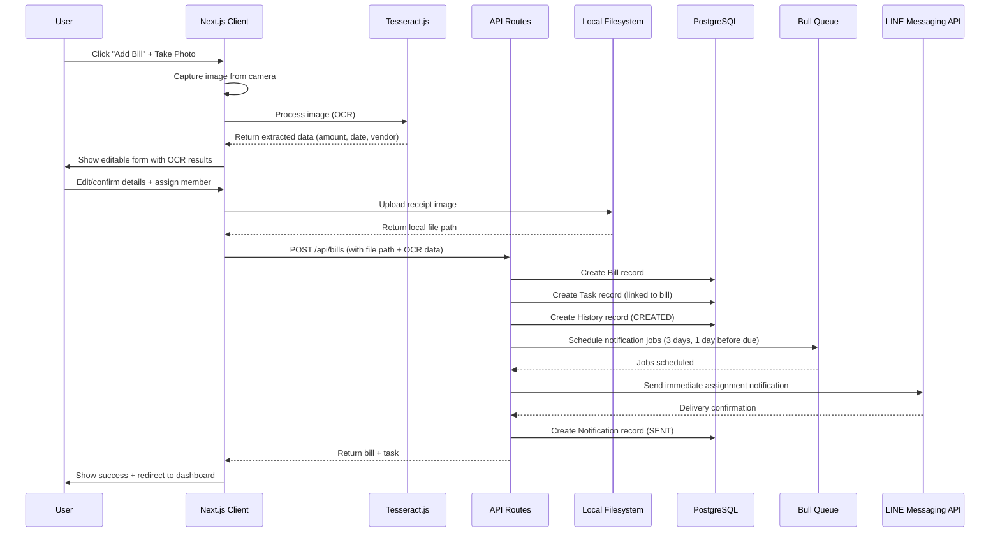
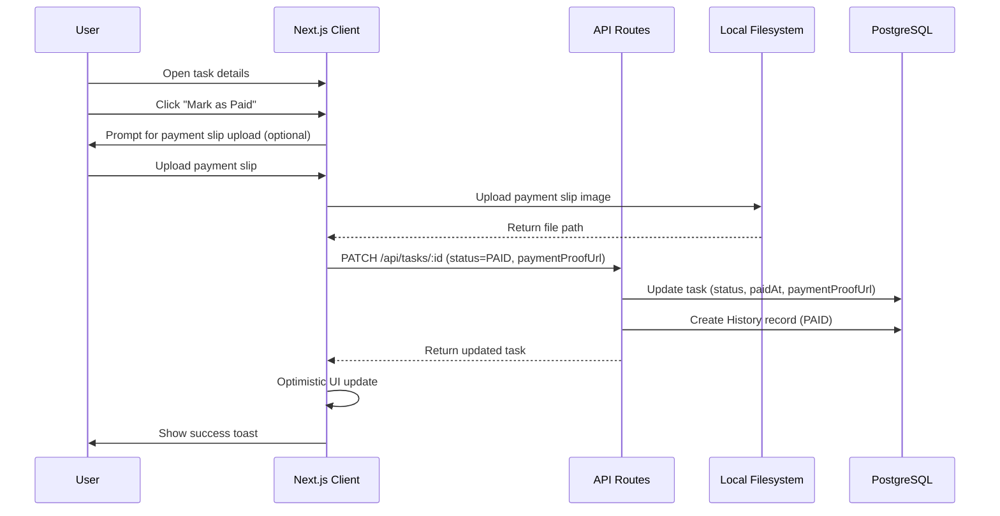
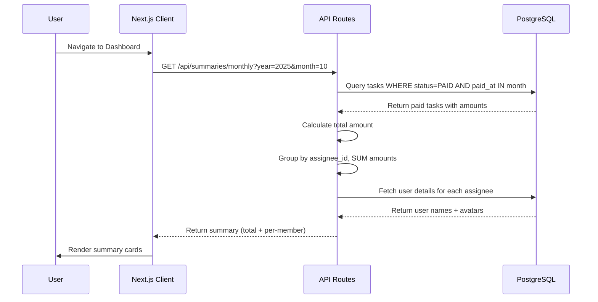
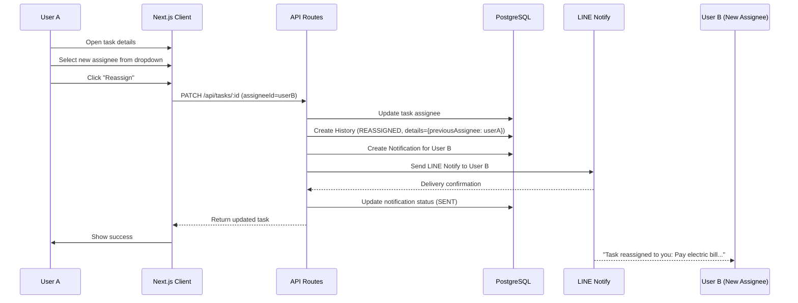

# Core Workflows

## Workflow 1: Bill Upload & Task Creation

```mermaid
sequenceDiagram
    participant User
    participant Client as Next.js Client
    participant Tesseract as Tesseract.js
    participant API as API Routes
    participant FS as Local Filesystem
    participant DB as PostgreSQL
    participant Queue as Bull Queue
    participant LINE as LINE Messaging API

    User->>Client: Click "Add Bill" + Take Photo
    Client->>Client: Capture image from camera
    Client->>Tesseract: Process image (OCR)
    Tesseract-->>Client: Return extracted data (amount, date, vendor)
    Client->>User: Show editable form with OCR results
    User->>Client: Edit/confirm details + assign member
    Client->>FS: Upload receipt image
    FS-->>Client: Return local file path
    Client->>API: POST /api/bills (with file path + OCR data)
    API->>DB: Create Bill record
    API->>DB: Create Task record (linked to bill)
    API->>DB: Create History record (CREATED)
    API->>Queue: Schedule notification jobs (3 days, 1 day before due)
    Queue-->>API: Jobs scheduled
    API->>LINE: Send immediate assignment notification
    LINE-->>API: Delivery confirmation
    API->>DB: Create Notification record (SENT)
    API-->>Client: Return bill + task
    Client->>User: Show success + redirect to dashboard
```

## Workflow 2: Mark Task as Paid

```mermaid
sequenceDiagram
    participant User
    participant Client as Next.js Client
    participant API as API Routes
    participant FS as Local Filesystem
    participant DB as PostgreSQL

    User->>Client: Open task details
    User->>Client: Click "Mark as Paid"
    Client->>User: Prompt for payment slip upload (optional)
    User->>Client: Upload payment slip
    Client->>FS: Upload payment slip image
    FS-->>Client: Return file path
    Client->>API: PATCH /api/tasks/:id (status=PAID, paymentProofUrl)
    API->>DB: Update task (status, paidAt, paymentProofUrl)
    API->>DB: Create History record (PAID)
    API-->>Client: Return updated task
    Client->>Client: Optimistic UI update
    Client->>User: Show success toast
```

## Workflow 3: Monthly Summary Calculation

```mermaid
sequenceDiagram
    participant User
    participant Client as Next.js Client
    participant API as API Routes
    participant DB as PostgreSQL

    User->>Client: Navigate to Dashboard
    Client->>API: GET /api/summaries/monthly?year=2025&month=10
    API->>DB: Query tasks WHERE status=PAID AND paid_at IN month
    DB-->>API: Return paid tasks with amounts
    API->>API: Calculate total amount
    API->>API: Group by assignee_id, SUM amounts
    API->>DB: Fetch user details for each assignee
    DB-->>API: Return user names + avatars
    API-->>Client: Return summary (total + per-member)
    Client->>User: Render summary cards
```

## Workflow 4: Task Reassignment

```mermaid
sequenceDiagram
    participant User as User A
    participant Client as Next.js Client
    participant API as API Routes
    participant DB as PostgreSQL
    participant LINE as LINE Notify
    participant UserB as User B (New Assignee)

    User->>Client: Open task details
    User->>Client: Select new assignee from dropdown
    User->>Client: Click "Reassign"
    Client->>API: PATCH /api/tasks/:id (assigneeId=userB)
    API->>DB: Update task assignee
    API->>DB: Create History (REASSIGNED, details={previousAssignee: userA})
    API->>DB: Create Notification for User B
    API->>LINE: Send LINE Notify to User B
    LINE-->>API: Delivery confirmation
    API->>DB: Update notification status (SENT)
    API-->>Client: Return updated task
    Client->>User: Show success
    LINE-->>UserB: "Task reassigned to you: Pay electric bill..."
```

---
