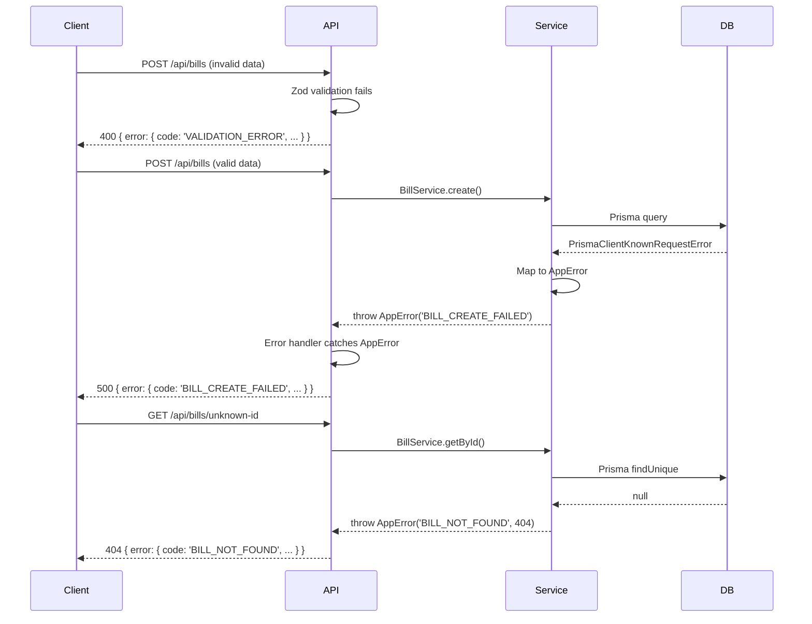

# Error Handling Strategy

## Error Flow



## Error Response Format

```typescript
// lib/types/api.ts
interface ApiError {
  error: {
    code: string;           // Machine-readable error code
    message: string;        // Human-readable message
    details?: Record<string, any>;  // Additional context
    timestamp: string;      // ISO 8601 timestamp
    requestId: string;      // For debugging
  };
}

// Error codes
const ErrorCodes = {
  VALIDATION_ERROR: 'VALIDATION_ERROR',
  UNAUTHORIZED: 'UNAUTHORIZED',
  FORBIDDEN: 'FORBIDDEN',
  NOT_FOUND: 'NOT_FOUND',
  BILL_CREATE_FAILED: 'BILL_CREATE_FAILED',
  TASK_UPDATE_FAILED: 'TASK_UPDATE_FAILED',
  NOTIFICATION_SEND_FAILED: 'NOTIFICATION_SEND_FAILED',
  INTERNAL_SERVER_ERROR: 'INTERNAL_SERVER_ERROR',
} as const;
```

## Frontend Error Handling

```typescript
// lib/utils/api-client.ts
import { toast } from '@/components/ui/use-toast';

export async function apiCall<T>(
  url: string,
  options?: RequestInit
): Promise<T> {
  try {
    const response = await fetch(url, {
      ...options,
      headers: {
        'Content-Type': 'application/json',
        ...options?.headers,
      },
    });

    const data = await response.json();

    if (!response.ok) {
      // Server returned error response
      const error = data.error;
      toast({
        title: 'Error',
        description: error.message,
        variant: 'destructive',
      });
      throw new ApiError(error);
    }

    return data.data;
  } catch (error) {
    // Network error or JSON parse error
    if (error instanceof ApiError) throw error;

    toast({
      title: 'Network Error',
      description: 'Please check your connection and try again.',
      variant: 'destructive',
    });
    throw error;
  }
}

export class ApiError extends Error {
  constructor(public error: ApiError['error']) {
    super(error.message);
    this.name = 'ApiError';
  }
}
```

## Backend Error Handling

```typescript
// lib/utils/api-response.ts
import { NextResponse } from 'next/server';
import { ZodError } from 'zod';
import { Prisma } from '@prisma/client';

export function errorResponse(error: unknown, requestId: string) {
  console.error('[API Error]', error);

  // Zod validation error
  if (error instanceof ZodError) {
    return NextResponse.json(
      {
        error: {
          code: 'VALIDATION_ERROR',
          message: 'Invalid request data',
          details: error.errors,
          timestamp: new Date().toISOString(),
          requestId,
        },
      },
      { status: 400 }
    );
  }

  // Prisma errors
  if (error instanceof Prisma.PrismaClientKnownRequestError) {
    if (error.code === 'P2002') {
      return NextResponse.json(
        {
          error: {
            code: 'DUPLICATE_ENTRY',
            message: 'This record already exists',
            timestamp: new Date().toISOString(),
            requestId,
          },
        },
        { status: 409 }
      );
    }
  }

  // Custom AppError
  if (error instanceof AppError) {
    return NextResponse.json(
      {
        error: {
          code: error.code,
          message: error.message,
          details: error.details,
          timestamp: new Date().toISOString(),
          requestId,
        },
      },
      { status: error.statusCode }
    );
  }

  // Unknown error
  return NextResponse.json(
    {
      error: {
        code: 'INTERNAL_SERVER_ERROR',
        message: 'An unexpected error occurred',
        timestamp: new Date().toISOString(),
        requestId,
      },
    },
    { status: 500 }
  );
}

export class AppError extends Error {
  constructor(
    public code: string,
    message: string,
    public statusCode: number = 500,
    public details?: Record<string, any>
  ) {
    super(message);
    this.name = 'AppError';
  }
}
```

---
