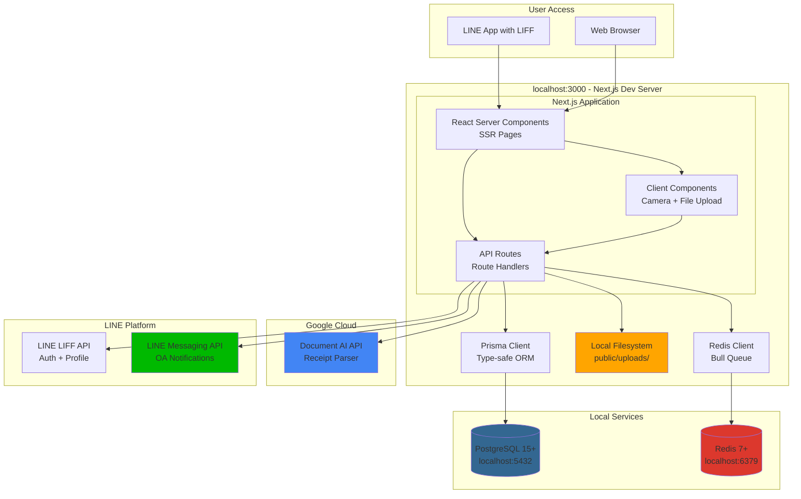

# High Level Architecture

## Technical Summary

This application follows a **modern fullstack architecture** using Next.js 14+ with the App Router pattern, providing server-side rendering, React Server Components, and API routes in a unified local development environment. The frontend uses React Server Components by default for optimal performance, with client components for interactive features like camera access and file uploads. The backend uses Next.js Route Handlers with Prisma ORM for type-safe PostgreSQL operations. Key integration points include LINE LIFF SDK for authentication and in-app browser experience, LINE Messaging API for push notifications, Google Cloud Document AI for high-accuracy receipt OCR, Bull queue with Redis for scheduled notifications, and local file storage for images. The simplified data model features a **single-user architecture** where each user manages only their own bills and tasks—when a user creates a bill, a task is automatically created for them. No assignments, no members, no groups. This architecture achieves rapid hackathon development with everything running locally on localhost.

## Platform and Infrastructure Choice

**Platform:** Local Development Environment

**Key Services:**
- **Hosting:** Next.js Dev Server (localhost:3000)
- **Database:** PostgreSQL (installed locally via Homebrew/apt-get)
- **Queue Storage:** Redis (installed locally via Homebrew/apt-get)
- **File Storage:** Local filesystem (`public/uploads` directory)
- **Authentication:** LINE LIFF SDK + NextAuth.js (session cookies)
- **Notifications:** LINE Messaging API (Official Account)
- **OCR:** Google Cloud Document AI (cloud-based, high accuracy)

**Why Local Development?**
- Zero deployment complexity for hackathon demo
- Full control over data and debugging
- Google Cloud free tier for Document AI (1000 pages/month)
- Direct installation for faster setup (no Docker overhead)
- Fast iteration with hot reload

## Repository Structure

**Structure:** Single Next.js monolithic application (monorepo not needed for this scale)

**Package Organization:**
```
household-bills/
├── app/                    # Next.js 14+ App Router
├── lib/                    # Shared utilities and types
├── prisma/                 # Database schema
├── public/                 # Static assets & uploads
│   └── uploads/           # Receipt & payment slip images
├── components/             # Shared React components
└── gcp-credentials.json    # Google Cloud service account key (gitignored)
```

**Rationale:**
- Hackathon scale doesn't require Turborepo/Nx complexity
- Next.js built-in features handle code sharing effectively
- Local-only = no deployment configuration needed
- Simpler mental model for team collaboration

## High Level Architecture Diagram



## Architectural Patterns

- **Server Components First:** Use React Server Components by default, client components only for interactivity (camera, OCR, notifications) - _Rationale:_ Reduces JavaScript bundle size, faster page loads, better mobile performance

- **API Route Handler Pattern:** Next.js 14+ Route Handlers with consistent error handling and response format - _Rationale:_ Type-safe endpoints, automatic serialization, integrated with Next.js middleware

- **Repository Pattern:** Data access abstraction layer (`lib/repositories`) wrapping Prisma - _Rationale:_ Business logic separated from ORM details, easier testing, potential database migration flexibility

- **Service Layer Pattern:** Business logic in `lib/services` (BillService, TaskService, NotificationService) - _Rationale:_ Reusable across API routes and Server Actions, testable in isolation

- **Optimistic UI Updates:** Client-side state updates before server confirmation for task status changes - _Rationale:_ Better UX on mobile networks, perceived performance improvement

- **Progressive Enhancement:** Core functionality works with JavaScript disabled, enhanced with client features - _Rationale:_ Reliability on unstable connections, better accessibility

- **Type-Driven Development:** Prisma schema as single source of truth for data types - _Rationale:_ Auto-generated TypeScript types prevent type mismatches, fewer runtime errors

- **Background Job Processing:** Bull queue for scheduled notifications and recurring tasks - _Rationale:_ Decouples notification delivery from API requests, automatic retries, cron-based scheduling for bill reminders

---
